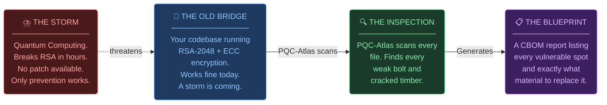
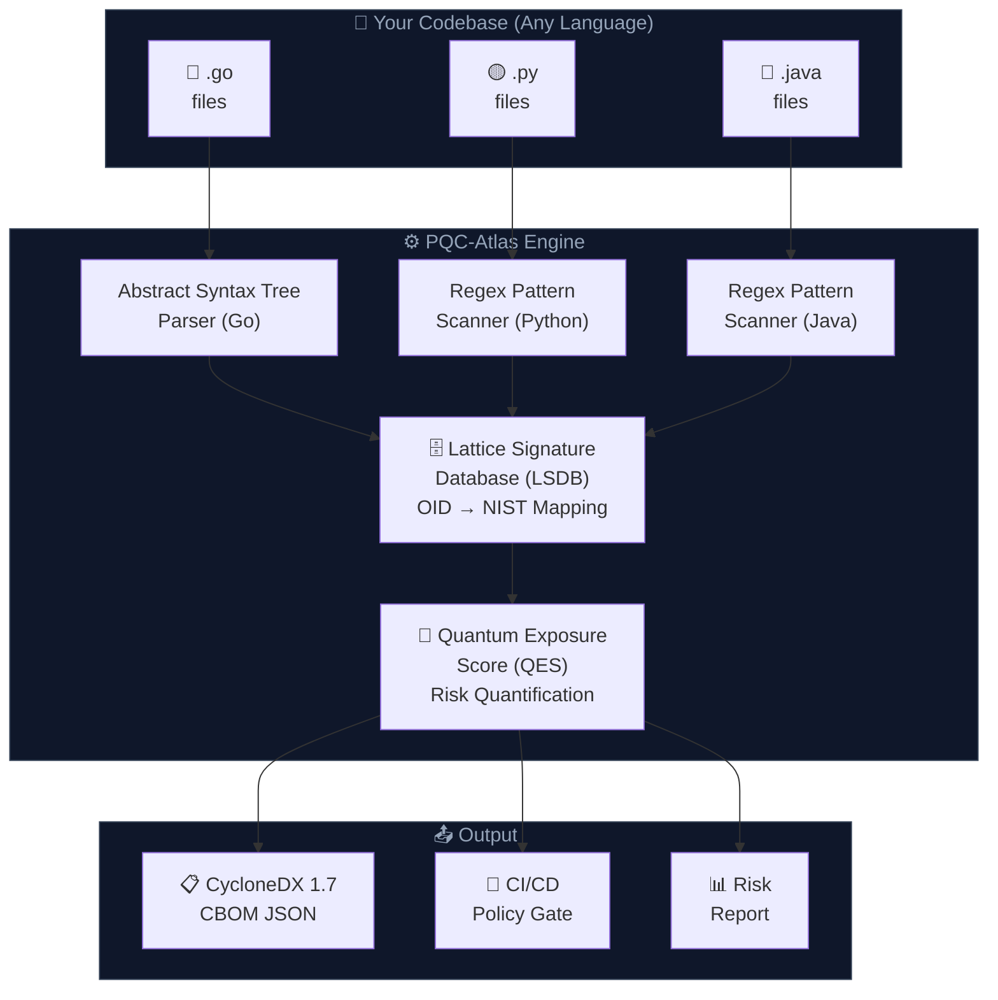
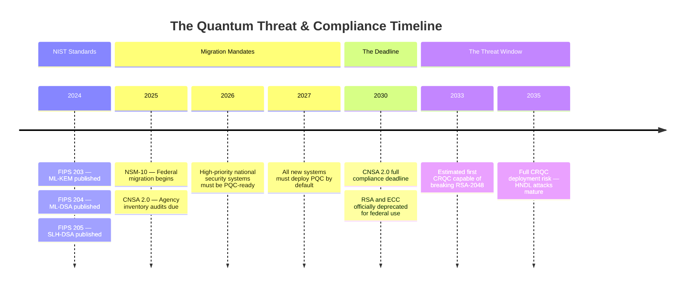
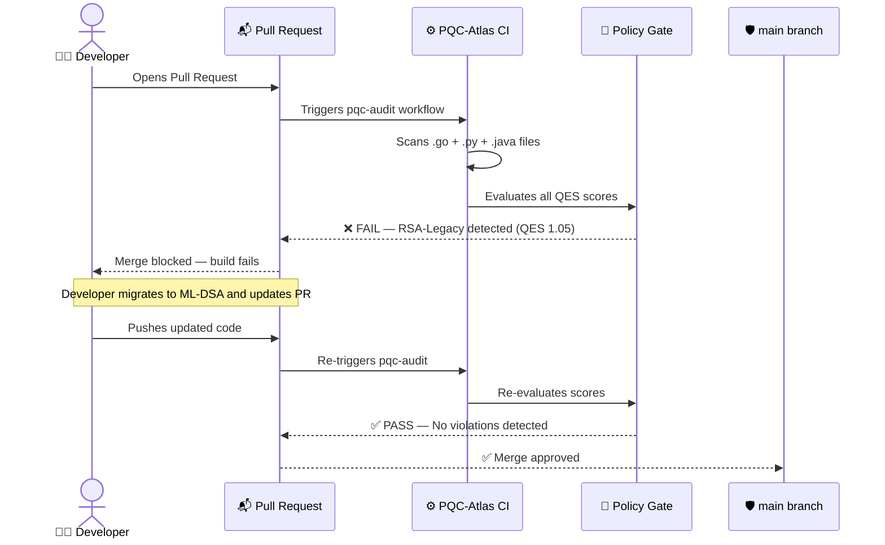
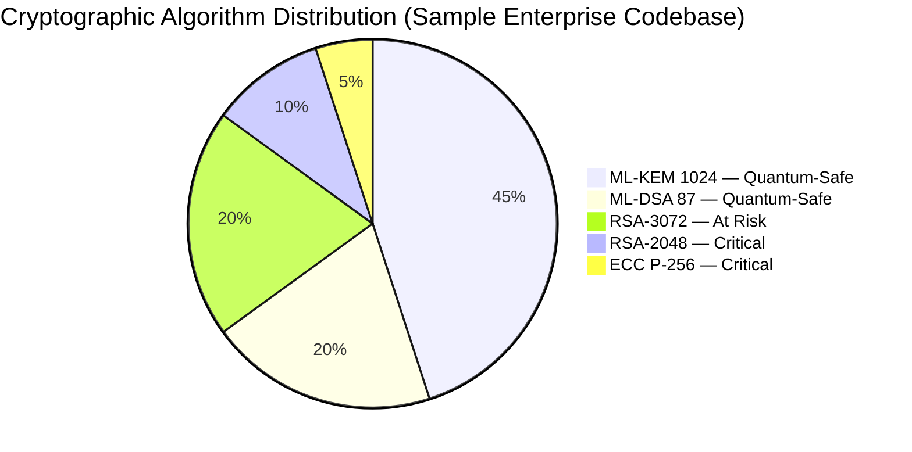
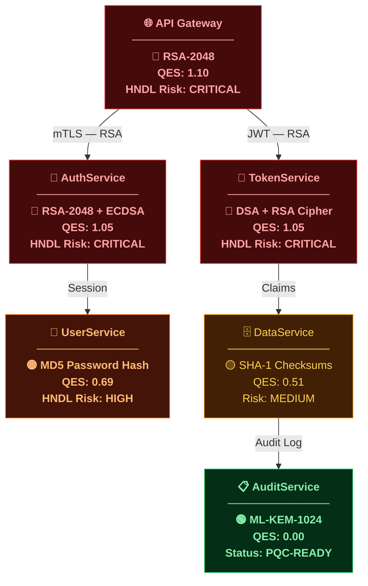
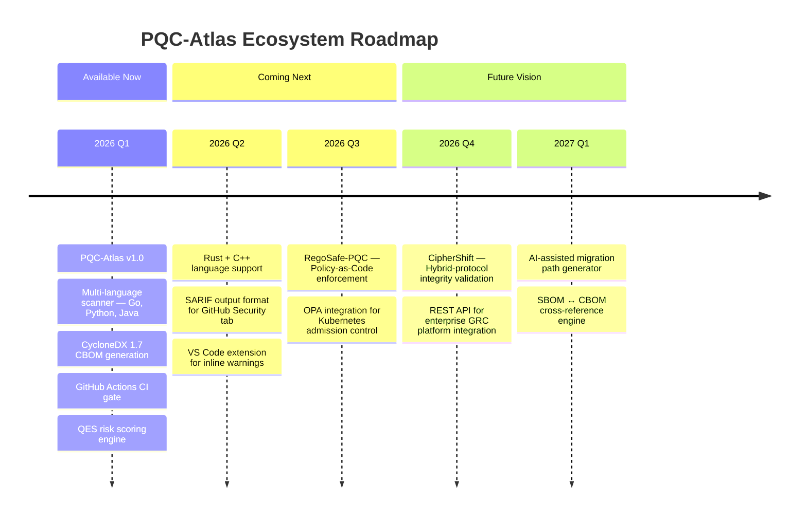

<div align="center">


<h1>PQC-Atlas</h1>

<h3><em>Automated Cryptographic Discovery & Observability Engine</em></h3>

<p><strong>Find every quantum-vulnerable algorithm in your codebase — before a quantum computer finds it for you.</strong></p>

<br/>

[](https://golang.org/)
[](https://csrc.nist.gov/projects/post-quantum-cryptography)
[](https://cyclonedx.org/)
[](LICENSE)

[](https://github.com/saisravan909/pqc-atlas/actions/workflows/pqc-audit.yml)
[]()
[]()
[]()

<br/>

> *"The biggest risk in the post-quantum transition is not the algorithms we know are broken — it's the ones we forgot we were using."*

</div>

---

## 📖 Table of Contents

| | Section |
|:---:|:---|
| 🎯 | [The Problem — Cryptographic Blindness](#-the-problem-cryptographic-blindness) |
| 🌉 | [The Big Picture — A Bridge Analogy](#-the-big-picture-a-bridge-analogy) |
| ⚙️ | [How PQC-Atlas Works](#️-how-pqc-atlas-works) |
| ⏳ | [The Quantum Threat Timeline](#-the-quantum-threat-timeline) |
| 🔬 | [Language Support](#-language-support) |
| 🖥️ | [Live Demo — Real Scan Output](#️-live-demo-real-scan-output) |
| 🔄 | [The CI/CD Gate — How Violations Are Blocked](#-the-cicd-gate-how-violations-are-blocked) |
| 📊 | [Cryptographic Inventory](#-cryptographic-inventory) |
| 🔥 | [Microservice Risk Heatmap](#-microservice-risk-heatmap) |
| 📋 | [Sample CBOM Output](#-sample-cbom-output) |
| 🛠️ | [Installation & Usage](#️-installation--usage) |
| 🗺️ | [Ecosystem Roadmap](#️-ecosystem-roadmap) |
| 📄 | [License](#-license) |

---

## 🎯 The Problem: Cryptographic Blindness

<div align="center">

```
┌─────────────────────────────────────────────────────────────────────┐
│                                                                     │
│   FACT: 99% of enterprise codebases contain quantum-vulnerable      │
│   cryptography. Most teams have no idea where it is.               │
│                                                                     │
│   FACT: NSM-10 and CNSA 2.0 mandate full PQC migration by 2030.   │
│                                                                     │
│   FACT: You cannot migrate what you cannot find.                   │
│                                                                     │
│   ► This gap is called CRYPTOGRAPHIC BLINDNESS.                    │
│   ► PQC-Atlas eliminates it.                                       │
│                                                                     │
└─────────────────────────────────────────────────────────────────────┘
```

</div>

The threat is called **HNDL — "Harvest Now, Decrypt Later."** Adversaries are actively collecting encrypted data *today*, storing it until a Cryptographically-Relevant Quantum Computer (CRQC) exists to break it. The encryption protecting your secrets right now may already be compromised — it just hasn't been decrypted yet.

---

## 🌉 The Big Picture: A Bridge Analogy

> *For executives, policymakers, and non-technical stakeholders.*



<br/>

<div align="center">

| 🌉 The Old Bridge | 🔍 The Inspection | 📋 The Blueprint | ⛈️ The Storm |
|:---:|:---:|:---:|:---:|
| Your codebase. RSA-2048, ECC, DSA. Works today. | PQC-Atlas walks every line. Zero-touch. No code executed. | A CBOM listing every risk, ranked by severity, with exact NIST replacements. | Quantum computers. Shor's Algorithm. Breaking RSA in hours. |
| *"The bridge looks fine"* | *"We found 47 weak bolts"* | *"Replace these 47 with ML-DSA"* | *"The storm has a 2030 deadline"* |

</div>

---

## ⚙️ How PQC-Atlas Works



**What makes PQC-Atlas different from a keyword search:**

| Approach | "grep RSA" | PQC-Atlas |
|:---|:---:|:---:|
| Understands code structure | ❌ | ✅ AST parsing |
| Ignores comments & strings | ❌ | ✅ |
| Extracts key size from arguments | ❌ | ✅ |
| Maps to NIST PQC replacement | ❌ | ✅ LSDB |
| Quantified risk score | ❌ | ✅ QES formula |
| CI/CD pipeline integration | ❌ | ✅ |
| Standards-compliant output | ❌ | ✅ CycloneDX 1.7 |

---

## ⏳ The Quantum Threat Timeline



---

## 🔬 Language Support

<div align="center">

| Language | Engine | Detects | Status |
|:---:|:---:|:---|:---:|
|  | **AST Parser** — full code structure analysis | RSA, ECDSA, ECC, DSA, MD5, SHA-1, DES | ✅ Active |
|  | **Regex Scanner** — import + call detection | `rsa.generate_private_key`, `ec.generate_private_key`, `RSA.generate`, `hashlib.md5/sha1`, DSA | ✅ Active |
|  | **Regex Scanner** — `java.security` / `javax.crypto` | `KeyPairGenerator`, `Cipher.getInstance`, `Signature.getInstance`, `MessageDigest` | ✅ Active |
|  | Pattern Scanner | `ring::signature::RsaKeyPair`, legacy `openssl` crate | 🗓 Q2 2026 |
|  | Pattern Scanner | OpenSSL `RSA_generate_key`, `EC_KEY_new_by_curve_name` | 🗓 Q3 2026 |

</div>

---

## 🖥️ Live Demo: Real Scan Output

> The following is **actual output** — produced by running PQC-Atlas against the `examples/legacy-app/` included in this repository. A realistic microservice spanning Go, Python, and Java.

```
$ go run main.go scan --path examples/

──────────────────────────────────────────────────
  PQC-ATLAS: Cryptographic Observability Engine
  Status: NIST FIPS 203/204 Compliance Mode
──────────────────────────────────────────────────

[*] Initializing AST Discovery Engine on: examples/

[java]   TokenService.java:16  — RSA-Legacy detected
[java]   TokenService.java:24  — ECC-Legacy detected
[java]   TokenService.java:32  — DSA-Legacy detected
[java]   TokenService.java:40  — RSA-Legacy detected  (Signature)
[java]   TokenService.java:49  — RSA-Legacy detected  (Cipher)
[java]   TokenService.java:57  — MD5 detected
[java]   TokenService.java:65  — SHA-1 detected
[python] auth_service.py:13    — RSA-Legacy detected
[python] auth_service.py:21    — ECC-Legacy detected
[python] auth_service.py:28    — DSA-Legacy detected
[python] auth_service.py:36    — MD5 detected
[python] auth_service.py:41    — SHA-1 detected
[go]     main.go:15            — RSA-Legacy-2048 detected
[go]     main.go:24            — ECDSA-Legacy detected
[go]     main.go:24            — ECC-Legacy detected
[go]     main.go:33            — MD5 detected
[go]     main.go:40            — SHA-1 detected

[+] Scan Complete. 17 cryptographic primitives found in 3.51ms.
──────────────────────────────────────────────────

  FILE                   LINE  ALGORITHM      RISK                           QES   NIST REPLACEMENT
  ─────────────────────────────────────────────────────────────────────────────────────────────────
  TokenService.java       16   RSA-Legacy     Quantum-Vulnerable (HNDL)     1.05  FIPS 204 — ML-DSA
  TokenService.java       24   ECC-Legacy     Quantum-Vulnerable (HNDL)     1.00  FIPS 203 — ML-KEM
  TokenService.java       32   DSA-Legacy     Quantum-Vulnerable (HNDL)     1.05  FIPS 204 — ML-DSA
  TokenService.java       40   RSA-Legacy     Quantum-Vulnerable (HNDL)     1.05  FIPS 204 — ML-DSA
  TokenService.java       57   MD5            Quantum-Weakened  (HNDL)      0.69  SHA-3 (FIPS 202)
  TokenService.java       65   SHA-1          Classically Deprecated        0.51  SHA-3 (FIPS 202)
  auth_service.py         13   RSA-Legacy     Quantum-Vulnerable (HNDL)     1.05  FIPS 204 — ML-DSA
  auth_service.py         21   ECC-Legacy     Quantum-Vulnerable (HNDL)     1.00  FIPS 203 — ML-KEM
  auth_service.py         28   DSA-Legacy     Quantum-Vulnerable (HNDL)     1.05  FIPS 204 — ML-DSA
  auth_service.py         36   MD5            Quantum-Weakened  (HNDL)      0.69  SHA-3 (FIPS 202)
  main.go                 15   RSA-Legacy     Quantum-Vulnerable (HNDL)     1.10  FIPS 204 — ML-DSA
  main.go                 24   ECDSA-Legacy   Quantum-Vulnerable (HNDL)     1.05  FIPS 204 — ML-DSA

[*] Exporting CycloneDX 1.7 CBOM → ./cbom.json
[+] CBOM written. 17 component(s) inventoried.
```

---

## 🔄 The CI/CD Gate: How Violations Are Blocked

> Every pull request is scanned automatically. Quantum-vulnerable code never reaches `main`.



---

## 📊 Cryptographic Inventory



<br/>

<div align="center">

| Algorithm | Status | NIST Standard | QES Score | Readiness |
| :--- | :---: | :---: | :---: | :---: |
| **ML-KEM-1024** | ✅ Quantum-Safe | FIPS 203 | 0.00 | 🟢 PQC Ready |
| **ML-DSA-87** | ✅ Quantum-Safe | FIPS 204 | 0.00 | 🟢 PQC Ready |
| **SLH-DSA** | ✅ Quantum-Safe | FIPS 205 | 0.00 | 🟢 PQC Ready |
| **RSA-4096** | ⚠️ Transitional | FIPS 186-5 | 0.45 | 🟡 Plan Migration |
| **RSA-3072** | ⚠️ At Risk | FIPS 186-5 | 0.72 | 🟡 Migrate Soon |
| **RSA-2048** | 🛑 Critical | Deprecated | 1.10 | 🔴 HNDL Risk |
| **ECC P-256** | 🛑 Critical | Deprecated | 1.00 | 🔴 HNDL Risk |
| **ECDSA** | 🛑 Critical | Deprecated | 1.05 | 🔴 HNDL Risk |
| **DSA** | 🛑 Critical | Deprecated | 1.05 | 🔴 HNDL Risk |
| **MD5** | ⛔ Broken | None | 0.69 | 🔴 Remove Now |
| **SHA-1** | ⛔ Deprecated | None | 0.51 | 🔴 Remove Now |

</div>

---

## 🔥 Microservice Risk Heatmap

> PQC-Atlas maps the **cryptographic blast radius** of your microservice mesh — showing exactly which services carry the highest HNDL exposure.



<br/>

<div align="center">

| 🔴 CRITICAL — HNDL Risk | 🟡 HIGH — Quantum-Weakened | 🟢 PQC-READY |
|:---:|:---:|:---:|
| API Gateway, AuthService, TokenService | UserService, DataService | AuditService |
| RSA-2048, ECDSA, DSA active | MD5, SHA-1 in use | ML-KEM-1024 deployed |
| **Immediate remediation required** | **Plan migration within 6 months** | **No action needed** |

</div>

---

## 📋 Sample CBOM Output

> The Cryptographic Bill of Materials is a machine-readable inventory — the same format used by federal risk management and GRC platforms.

```json
{
  "bomFormat": "CycloneDX",
  "specVersion": "1.7",
  "serialNumber": "urn:uuid:pqc-atlas-scan-2026",
  "metadata": {
    "timestamp": "2026-03-31T00:00:00Z",
    "tools": [{ "name": "PQC-Atlas", "version": "1.0.0" }]
  },
  "components": [
    {
      "type": "cryptoAsset",
      "name": "RSA",
      "cryptoProperties": {
        "assetType": "algorithm",
        "algorithmProperties": {
          "parameterSetIdentifier": "2048",
          "curve": "N/A",
          "executionEnvironment": "software",
          "implementationPlatform": "Go — crypto/rsa"
        },
        "oid": "1.2.840.113549.1.1.1",
        "pqcReadiness": "UNSAFE"
      },
      "evidence": {
        "occurrences": [{ "location": "services/auth/main.go", "line": 15 }]
      },
      "recommendation": "Migrate to FIPS 204 — ML-DSA (CRYSTALS-Dilithium)"
    }
  ]
}
```

---

## 🛠️ Installation & Usage

### Prerequisites

- Go 1.21 or later
- The target source code repository

### Quick Start

```bash
# Clone PQC-Atlas
git clone https://github.com/saisravan909/pqc-atlas.git
cd pqc-atlas

# Scan any codebase — Go, Python, and Java supported
go run main.go scan --path /path/to/your/repo

# Export a CycloneDX 1.7 CBOM
go run main.go export --path /path/to/your/repo --out cbom.json

# Run as a compliance gate (returns exit code 1 on violations)
go run main.go audit --path . --fail-on-violation
```

### GitHub Actions CI

Drop-in CI gate included at `.github/workflows/pqc-audit.yml`. Activates on every pull request:

```
1. Builds scanner from source
2. Runs compliance audit against the full repository
3. Blocks merge if any CRITICAL or HIGH violations are found
4. Uploads CBOM as a signed build artifact (retained 90 days)
```

<details>
<summary>📄 View pqc-audit.yml</summary>

```yaml
name: PQC-Atlas Compliance Audit

on:
  pull_request:
    branches: ["main"]

jobs:
  pqc-audit:
    runs-on: ubuntu-latest
    steps:
      - uses: actions/checkout@v4
      - uses: actions/setup-go@v5
        with:
          go-version: "1.21"
      - run: go build -o pqc-atlas ./main.go
      - run: ./pqc-atlas audit --path . --fail-on-violation
      - if: always()
        run: ./pqc-atlas export --path . --out cbom.json
      - if: always()
        uses: actions/upload-artifact@v4
        with:
          name: cbom-${{ github.sha }}
          path: cbom.json
```

</details>

---

## 🗺️ Ecosystem Roadmap



---

## 📄 License

Distributed under the **Apache License 2.0**.
Copyright © 2026 **Sai Sravan Cherukuri** & **Sai Saketh Cherukuri**. See [LICENSE](LICENSE) for full terms.

---

<div align="center">

**Built to protect the infrastructure of tomorrow — starting with the code of today.**

*Innovators: Sai Sravan Cherukuri & Sai Saketh Cherukuri*

[](https://github.com/saisravan909/pqc-atlas/stargazers)
[](https://github.com/saisravan909/pqc-atlas/network)
[](https://github.com/saisravan909/pqc-atlas/issues)

*If PQC-Atlas helped you, please consider starring the repository.*

</div>
