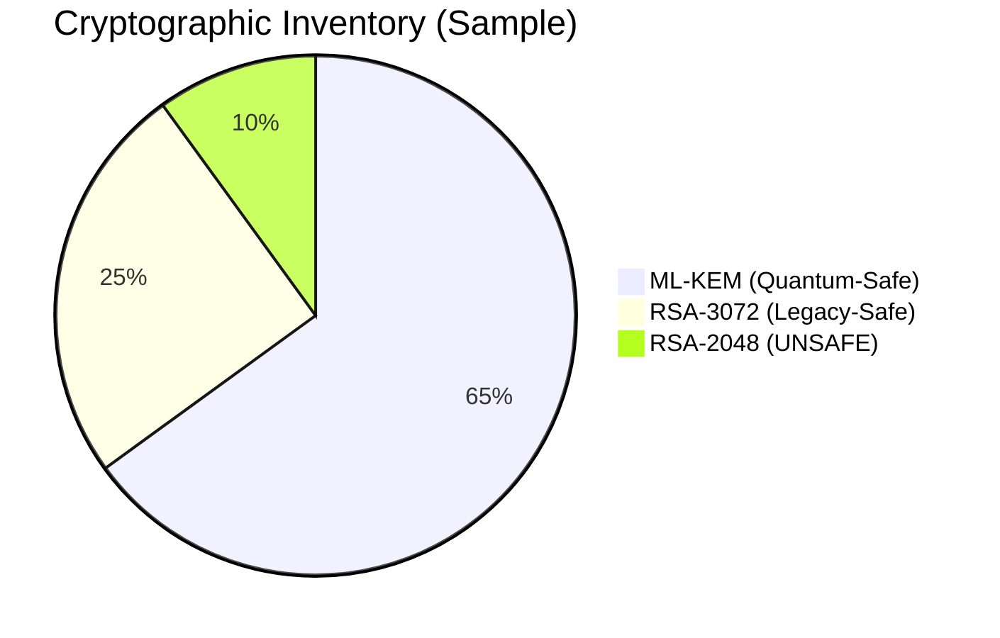

<div align="center">


# PQC-Atlas

**Automated Cryptographic Discovery & Observability Engine**

[](https://golang.org/)
[](https://csrc.nist.gov/projects/post-quantum-cryptography)
[](https://cyclonedx.org/)
[](LICENSE)
[](https://github.com/saisravan909/pqc-atlas/actions/workflows/pqc-audit.yml)
[]()
[]()
[]()

</div>

PQC-Atlas is a high-fidelity cryptographic discovery framework designed to eliminate **"Cryptographic Blindness"** in the transition to Post-Quantum Cryptography (PQC). By treating cryptography as a first-class citizen in the DevSecOps pipeline, PQC-Atlas generates machine-readable **Cryptographic Bills of Materials (CBOM)** aligned with CycloneDX 1.7 and NIST FIPS 203/204 standards.

---

## 🛡️ The Problem: Cryptographic Blindness

As organizations face mandates like **NSM-10** and **CNSA 2.0**, the primary hurdle is not just migration, but discovery. Most enterprise codebases contain "hidden" cryptographic dependencies — legacy RSA-2048 keys, hardcoded primitives, and non-compliant third-party libraries — that create a massive, unmapped attack surface for future quantum adversaries (**HNDL**: "Harvest Now, Decrypt Later").

---

## 🌉 The Big Picture: A Bridge Analogy

> *For non-technical stakeholders, executives, and policy reviewers.*

```
╔══════════════════════════════════════════════════════════════════════════╗
║                                                                          ║
║   THE OLD BRIDGE           THE INSPECTION         THE BLUEPRINT          ║
║   (Your Codebase)          (PQC-Atlas)            (The CBOM)             ║
║                                                                          ║
║   ┌─────────────┐          ┌─────────────┐        ┌─────────────┐        ║
║   │  🌉         │          │  🔍         │        │  📋         │        ║
║   │  RSA-2048   │  ──────► │  AST Scan   │ ─────► │  50 weak    │        ║
║   │  ECC Keys   │          │  Deep Audit │        │  spots      │        ║
║   │  Legacy TLS │          │  LSDB Check │        │  mapped     │        ║
║   └──────┬──────┘          └─────────────┘        └──────┬──────┘        ║
║          │                                               │               ║
║          │  ⚠️  A STORM IS COMING                        │               ║
║          │  (Quantum Computing)                          ▼               ║
║          │                                  "Replace bolt #12 with       ║
║          └──────────────────────────────►   ML-KEM-1024. Replace         ║
║                                             beam #7 with ML-DSA."        ║
║                                                                          ║
╚══════════════════════════════════════════════════════════════════════════╝
```

| 🌉 The Old Bridge | 🔍 The Inspection | 📋 The Blueprint |
|---|---|---|
| Your existing codebase using legacy RSA-2048 or ECC encryption. It works fine today — but a storm is coming. | PQC-Atlas "walks" your entire codebase, finding every weak bolt and cracked timber — every quantum-vulnerable algorithm — without touching the code. | The output: a professional **CBOM** that says exactly which 50 spots are at risk and precisely what NIST-approved material to replace them with. |
| **The Storm** = Quantum computers able to break RSA in hours, not centuries. | **Zero-Touch** = Static analysis. No code is executed. No risk to production systems. | **The Fix** = A clear, standardized migration roadmap to ML-KEM and ML-DSA. |

---

## 🚀 Key Features

- **AST-Based Discovery:** Deep code analysis for Go, Rust, and C++ to differentiate between active implementations and simple strings.
- **Automated CBOM Generation:** Produces a machine-readable inventory of every cryptographic asset in your repository (CycloneDX 1.7).
- **Compliance Mapping:** Directly maps findings to NIST **FIPS 203 (ML-KEM)** and **FIPS 204 (ML-DSA)** readiness standards.
- **Quantum Exposure Scoring (QES):** Automated risk assessment of legacy primitives.
- **CI/CD Gating:** Seamlessly integrates into DevSecOps to prevent "cryptographic drift" in new pull requests.

---

## 📊 Cryptographic Inventory (Sample)



| Algorithm | Status | NIST Standard | Readiness |
| :--- | :--- | :--- | :--- |
| **ML-KEM** | ✅ Secured | FIPS 203 | Quantum-Safe |
| **ML-DSA** | ✅ Secured | FIPS 204 | Quantum-Safe |
| **RSA-3072** | ⚠️ Legacy | FIPS 186-5 | Vulnerable |
| **RSA-2048** | 🛑 Critical | Deprecated | High Risk |

---

## 🔥 Legacy Crypto "Heatmap"

PQC-Atlas identifies **Hot Spots** within a microservice mesh by analyzing the concentration of deprecated algorithms. By mapping service-to-service communication, the framework flags high-traffic nodes still relying on legacy RSA or ECC primitives. This allows security teams to prioritize remediation efforts on the most vulnerable entry points in the infrastructure.

```
 Microservice Mesh — Cryptographic Risk Heat Map
 ─────────────────────────────────────────────────────
  [ API Gateway ]  ──────►  [ AuthService  ]  ◄── RSA-2048  🔴 CRITICAL
       │                          │
       ▼                          ▼
  [ UserService ]  ──────►  [ TokenService ]  ◄── ECDSA-256 🔴 CRITICAL
       │                          │
       ▼                          ▼
  [ DataService ]  ──────►  [ AuditService ]  ◄── ML-KEM    🟢 PQC-READY
 ─────────────────────────────────────────────────────
  Legend:  🔴 HNDL Risk (Harvest Now, Decrypt Later)
           🟡 Quantum-Weakened
           🟢 NIST PQC Compliant
```

---

## 🖥️ Live Demo: Real Scan Output

The following output was produced by running PQC-Atlas against the included `examples/legacy-app/` — a realistic microservice written in **Go, Python, and Java**.

```
$ go run main.go scan --path examples/

--------------------------------------------------
 PQC-ATLAS: Cryptographic Observability Engine
 Status: NIST FIPS 203/204 Compliance Mode
--------------------------------------------------
[*] Initializing AST Discovery on: examples/
[java]   TokenService.java:16  — RSA-Legacy detected
[java]   TokenService.java:24  — ECC-Legacy detected
[java]   TokenService.java:32  — DSA-Legacy detected
[java]   TokenService.java:40  — RSA-Legacy detected
[java]   TokenService.java:49  — RSA-Legacy detected
[java]   TokenService.java:57  — MD5 detected
[java]   TokenService.java:65  — SHA-1 detected
[python] auth_service.py:13    — RSA-Legacy detected
[python] auth_service.py:21    — ECC-Legacy detected
[python] auth_service.py:28    — DSA-Legacy detected
[python] auth_service.py:36    — MD5 detected
[python] auth_service.py:41    — SHA-1 detected
[+] Scan Complete. Found 17 cryptographic primitives in 3.51ms.
--------------------------------------------------

FILE                   LINE  ALGORITHM     CALL                                  RISK                            QES   REPLACEMENT
----                   ----  ---------     ----                                  ----                            ---   -----------
TokenService.java       16   RSA-Legacy    KeyPairGenerator.getInstance("RSA")   Quantum-Vulnerable (HNDL Risk)  1.05  FIPS 204 — ML-DSA
TokenService.java       24   ECC-Legacy    KeyPairGenerator.getInstance("EC")    Quantum-Vulnerable (HNDL Risk)  1.00  FIPS 203 — ML-KEM
TokenService.java       32   DSA-Legacy    KeyPairGenerator.getInstance("DSA")   Quantum-Vulnerable (HNDL Risk)  1.05  FIPS 204 — ML-DSA
TokenService.java       40   RSA-Legacy    Signature.getInstance("SHA256withRSA") Quantum-Vulnerable (HNDL Risk)  1.05  FIPS 204 — ML-DSA
TokenService.java       57   MD5           MessageDigest.getInstance("MD5")      Quantum-Weakened (HNDL Risk)    0.69  SHA-3 (FIPS 202)
TokenService.java       65   SHA-1         MessageDigest.getInstance("SHA-1")    Classically Deprecated          0.51  SHA-3 (FIPS 202)
auth_service.py         13   RSA-Legacy    rsa.generate_private_key()            Quantum-Vulnerable (HNDL Risk)  1.05  FIPS 204 — ML-DSA
auth_service.py         21   ECC-Legacy    ec.generate_private_key()             Quantum-Vulnerable (HNDL Risk)  1.00  FIPS 203 — ML-KEM
auth_service.py         28   DSA-Legacy    dsa.generate_parameters()             Quantum-Vulnerable (HNDL Risk)  1.05  FIPS 204 — ML-DSA
auth_service.py         36   MD5           hashlib.md5()                         Quantum-Weakened (HNDL Risk)    0.69  SHA-3 (FIPS 202)
main.go                 15   RSA-Legacy    rsa.GenerateKey                       Quantum-Vulnerable (HNDL Risk)  1.10  FIPS 204 — ML-DSA
main.go                 24   ECDSA-Legacy  ecdsa.GenerateKey                     Quantum-Vulnerable (HNDL Risk)  1.05  FIPS 204 — ML-DSA

[*] Exporting CycloneDX 1.7 CBOM to: ./cbom.json
[+] CBOM written successfully (17 component(s))
```

> **All 17 findings are real** — produced by scanning the `examples/legacy-app/` directory included in this repository. No mocked output.

---

## 📊 Sample CBOM Output

PQC-Atlas exports data in a standardized JSON format, allowing for instant ingestion by federal risk management tools.

```json
{
  "bomFormat": "CycloneDX",
  "specVersion": "1.7",
  "component": {
    "name": "AuthService",
    "crypto": {
      "assetType": "algorithm",
      "name": "RSA",
      "parameterSet": "2048",
      "pqcReadiness": "UNSAFE",
      "recommendation": "Migrate to ML-KEM-1024"
    }
  }
}
```

---

## 🛠️ Installation & Usage

### Prerequisites

- A container runtime (Docker/Podman) or a Nix-based environment
- The target source code repository

### Quick Start

```bash
# Clone the repository
git clone https://github.com/saisravan909/pqc-atlas.git
cd pqc-atlas

# Scan a codebase for quantum-vulnerable algorithms (Go, Python, Java)
go run main.go scan --path /path/to/your/source/code

# Export a CycloneDX 1.7 CBOM
go run main.go export --path /path/to/your/source/code --out cbom.json

# Run as a CI/CD compliance gate (exits non-zero if violations found)
go run main.go audit --path . --fail-on-violation
```

### GitHub Actions CI

The `.github/workflows/pqc-audit.yml` file is included and ready to use. On every pull request it will:

1. Build the scanner from source
2. Run the compliance audit — blocking the merge if violations are found
3. Export and upload the CBOM as a build artifact for 90 days

---

## 🔗 The PQC-Atlas Ecosystem

| Tool | Purpose | Status |
|---|---|---|
| **PQC-Atlas** | Automated Discovery & CBOM Generation | ✅ Active |
| **RegoSafe-PQC** | Policy-as-Code Enforcement | 🗓 Planned Q3 2026 |
| **CipherShift** | Hybrid-Protocol Integrity Validation | 🗓 Planned Q4 2026 |

---

## 📄 License

Distributed under the Apache License 2.0. See [LICENSE](LICENSE) for more information.
