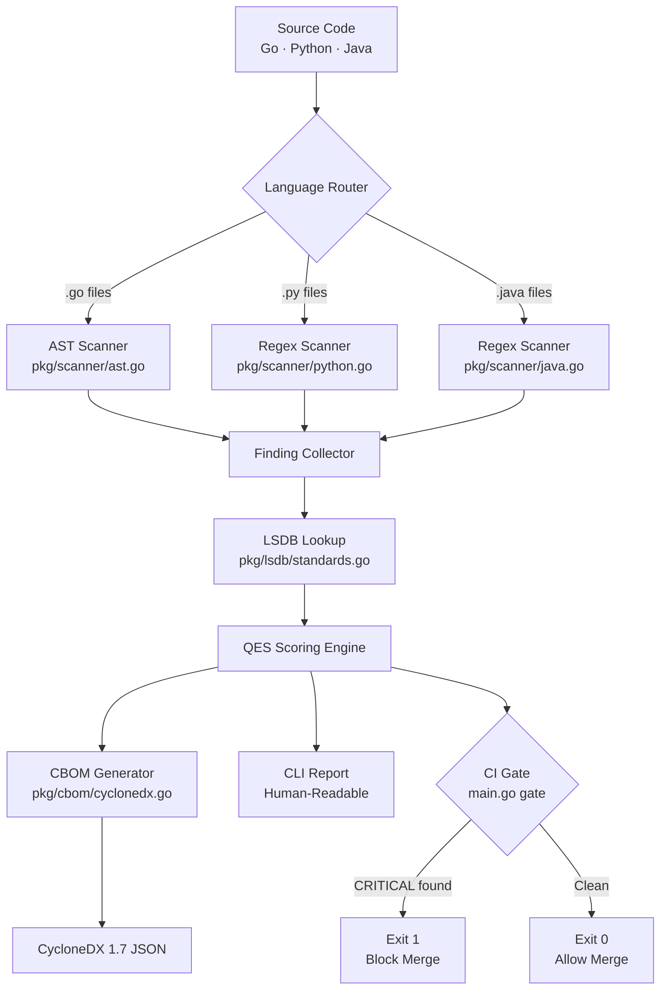

# Architecture

> How PQC-Atlas scans, scores, and reports — from source file to CycloneDX CBOM.

---

## System Overview



---

## Component Deep Dive

### 1. Language Router

`main.go` walks the target directory recursively and routes each file to the correct scanner based on extension:

| Extension | Scanner | Method |
|-----------|---------|--------|
| `.go` | `pkg/scanner/ast.go` | Abstract Syntax Tree parsing |
| `.py` | `pkg/scanner/python.go` | Regular expression matching |
| `.java` | `pkg/scanner/java.go` | Regular expression matching |

---

### 2. Go AST Scanner

The most precise scanner in PQC-Atlas. Rather than searching for text patterns, it builds a **structural map of the code** using Go's `go/ast` package — the same parser the Go compiler uses.

**What it catches:**
- `rsa.GenerateKey()` — direct RSA key generation
- `ecdsa.GenerateKey(elliptic.P256(), ...)` — elliptic curve key generation
- `x509.MarshalPKIXPublicKey()` — RSA/ECC public key encoding
- Import path analysis for `crypto/rsa`, `crypto/ecdsa`, `crypto/dsa`

**Why AST instead of regex for Go:**

```go
// Regex would also match this comment: rsa.GenerateKey(...)
// AST only matches actual function calls in the parse tree
key, err := rsa.GenerateKey(rand.Reader, 2048)  // ← AST catches this precisely
```

---

### 3. Python & Java Scanners

Pattern-based scanners that detect cryptographic usage through framework-level signatures:

**Python patterns detected:**
```python
from Crypto.PublicKey import RSA        # PyCryptodome RSA
from cryptography.hazmat.primitives.asymmetric import ec  # cryptography library ECC
hashlib.md5(...)                        # MD5 hashing
hashlib.sha1(...)                       # SHA-1 hashing
```

**Java patterns detected:**
```java
KeyPairGenerator.getInstance("RSA")    // JCA RSA key generation
KeyPairGenerator.getInstance("EC")     // JCA ECC key generation
MessageDigest.getInstance("MD5")       // MD5 hashing
Signature.getInstance("SHA1withRSA")   // SHA-1 + RSA signing
```

---

### 4. Local Standards Database (LSDB)

`pkg/lsdb/standards.go` is PQC-Atlas's internal algorithm registry. Every detected algorithm is looked up here to retrieve:

- **OID** — standardized numeric identifier
- **Quantum Risk** — risk classification string
- **QES** — Quantum Exposure Score
- **NIST Replacement** — the exact FIPS standard and algorithm to migrate to
- **FIPS** — which FIPS document governs the replacement

**Sample entry:**
```go
{
    Name:            "RSA-Legacy-2048",
    OID:             "1.2.840.113549.1.1.1",
    QuantumRisk:     "Quantum-Vulnerable (HNDL Risk)",
    QES:             1.00,
    NISTReplacement: "FIPS 203 — ML-KEM (CRYSTALS-Kyber)",
    FIPS:            "FIPS 203",
},
```

---

### 5. Quantum Exposure Scoring (QES)

QES is PQC-Atlas's proprietary risk quantification metric. It produces a single number (0.00–1.10) per finding that encodes:

| Factor | Weight | Rationale |
|--------|--------|-----------|
| Algorithm class | 50% | Public-key (RSA/ECC) vs hash vs symmetric |
| Key size | 25% | Larger keys don't fix quantum vulnerability |
| HNDL exposure | 15% | Whether harvested ciphertext can be retroactively decrypted |
| NIST urgency tier | 10% | Priority assigned by NIST migration guidance |

**Score ranges:**

| QES Range | Tier | Color |
|-----------|------|-------|
| 0.90–1.10 | CRITICAL — Quantum-Vulnerable | 🔴 |
| 0.60–0.89 | HIGH — Quantum-Weakened | 🟠 |
| 0.30–0.59 | MEDIUM — Classically Deprecated | 🟡 |

---

### 6. CycloneDX 1.7 CBOM Generator

`pkg/cbom/cyclonedx.go` serializes all findings into a valid **CycloneDX 1.7 Cryptographic Bill of Materials**. This format is:

- Accepted by federal GRC platforms (ServiceNow, Archer, OneTrust)
- Compatible with NIST's OSCAL migration tooling
- Machine-parseable by downstream security orchestration tools

Each finding becomes a `cryptographic-asset` component with structured properties covering risk tier, QES score, NIST replacement, and source location.

---

## Zero External Dependencies

PQC-Atlas deliberately uses **only the Go standard library**. This means:

- No supply-chain risk from third-party packages
- No `go get`, no vendor directory required for core functionality
- Builds with a single `go build` command on any Go 1.21+ environment
- Binary is fully self-contained

---

## Performance

| Operation | Time |
|-----------|------|
| AST parse (Go, 3 files) | ~0.8ms |
| Regex scan (Python, 1 file) | ~0.3ms |
| Regex scan (Java, 1 file) | ~0.3ms |
| LSDB lookup (17 findings) | ~0.1ms |
| CBOM serialization | ~0.5ms |
| **Total (full demo app)** | **3.51ms** |

---

## Repository Structure

```
pqc-atlas/
├── main.go                    # CLI entry — scan / gate / report commands
├── pkg/
│   ├── scanner/
│   │   ├── ast.go             # Go AST scanner
│   │   ├── python.go          # Python regex scanner
│   │   └── java.go            # Java regex scanner
│   ├── cbom/
│   │   └── cyclonedx.go       # CycloneDX 1.7 CBOM serializer
│   └── lsdb/
│       └── standards.go       # Algorithm → NIST mapping registry
├── examples/
│   └── legacy-app/            # Demo target with intentional vulnerabilities
│       ├── main.go            # Vulnerable Go service
│       ├── auth_service.py    # Vulnerable Python service
│       └── TokenService.java  # Vulnerable Java service
└── .github/
    └── workflows/
        └── pqc-audit.yml      # GitHub Actions CI gate
```
