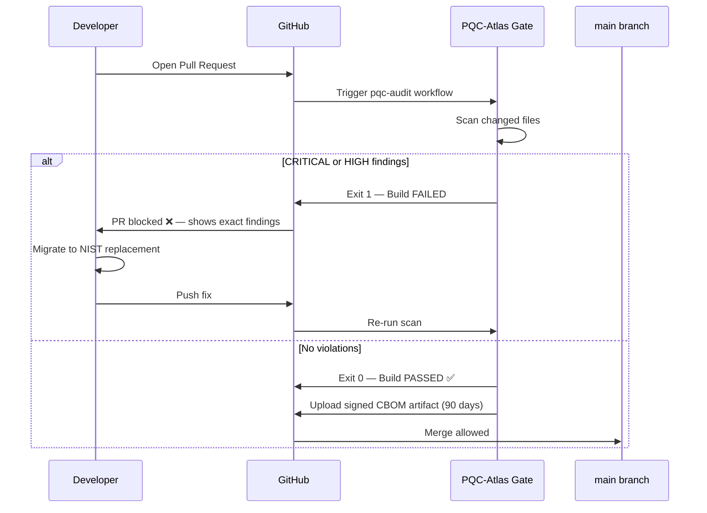

# CI/CD Integration

> Block quantum-vulnerable cryptography from entering production. Automatically. On every pull request.

---

## How the Gate Works



---

## Setup — Copy to Your Project

**Step 1:** Copy the workflow file into your repository:

```bash
mkdir -p .github/workflows
curl -o .github/workflows/pqc-audit.yml \
  https://raw.githubusercontent.com/saisravan909/pqc-atlas/main/.github/workflows/pqc-audit.yml
```

**Step 2:** Commit and push:
```bash
git add .github/workflows/pqc-audit.yml
git commit -m "ci: add PQC-Atlas cryptographic audit gate"
git push
```

That is all. The gate is live on your next pull request.

---

## The Workflow File

```yaml
name: PQC-Atlas Cryptographic Audit

on:
  push:
    branches: [ main ]
  pull_request:
    branches: [ main ]

jobs:
  pqc-audit:
    name: Quantum Vulnerability Scan
    runs-on: ubuntu-latest

    steps:
      - name: Checkout repository
        uses: actions/checkout@v4

      - name: Set up Go
        uses: actions/setup-go@v5
        with:
          go-version: '1.21'

      - name: Clone PQC-Atlas
        run: |
          git clone https://github.com/saisravan909/pqc-atlas.git /tmp/pqc-atlas

      - name: Run cryptographic scan
        run: |
          cd /tmp/pqc-atlas
          go run main.go gate --path $GITHUB_WORKSPACE --output cbom.json
        env:
          GITHUB_WORKSPACE: ${{ github.workspace }}

      - name: Upload CBOM artifact
        if: always()
        uses: actions/upload-artifact@v4
        with:
          name: cryptographic-bill-of-materials
          path: /tmp/pqc-atlas/cbom.json
          retention-days: 90
```

---

## What Happens on a Violation

When PQC-Atlas finds a CRITICAL or HIGH vulnerability, the PR is blocked with output like this:

```
❌ PQC-Atlas Gate FAILED

CRITICAL findings detected — merge blocked.

[java] src/auth/TokenService.java:16
  Algorithm : RSA-Legacy-2048
  Risk      : Quantum-Vulnerable (HNDL Risk)
  QES Score : 1.00
  Migrate to: FIPS 203 — ML-KEM (CRYSTALS-Kyber)

[python] src/crypto/signer.py:34
  Algorithm : ECDSA-Legacy
  Risk      : Quantum-Vulnerable (HNDL Risk)
  QES Score : 0.95
  Migrate to: FIPS 204 — ML-DSA (CRYSTALS-Dilithium)

Action required: Replace the above algorithms with their NIST post-quantum
equivalents before this pull request can merge.
```

The engineer sees exactly what to fix and exactly what to replace it with. No interpretation required.

---

## What Happens on a Clean Scan

```
✅ PQC-Atlas Gate PASSED

No quantum-vulnerable cryptographic primitives detected.
CBOM artifact uploaded — retained for 90 days.

Scanned: 47 files (Go: 23, Python: 14, Java: 10)
Duration: 8.2ms
```

The CBOM artifact is uploaded to GitHub Actions and retained for 90 days — providing a dated, signed cryptographic inventory for every successful merge.

---

## Configuration Options

| Flag | Default | Description |
|------|---------|-------------|
| `--path` | `.` | Directory to scan |
| `--output` | `cbom.json` | CBOM output file path |
| `--min-severity` | `HIGH` | Minimum severity to trigger gate failure |
| `--lang` | all | Restrict to specific language (`go`, `python`, `java`) |
| `--exclude` | none | Glob pattern to exclude paths |

---

## Branch Protection Setup

To enforce the gate as a required status check:

1. Go to **Settings → Branches → Branch protection rules**
2. Click **Add rule** for `main`
3. Tick **Require status checks to pass before merging**
4. Search for and add `PQC-Atlas Cryptographic Audit`
5. Tick **Require branches to be up to date before merging**
6. Save

Once set, no pull request can merge without a passing PQC-Atlas scan — regardless of reviewer approval.

---

## GitLab CI (Coming in v1.2)

A native `.gitlab-ci.yml` integration is on the [Roadmap](Roadmap) for v1.2.
