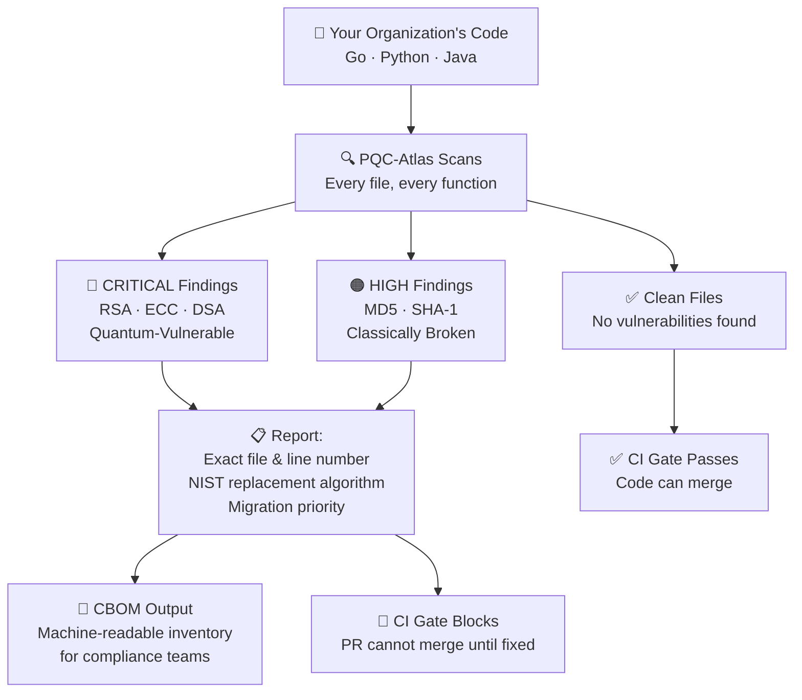
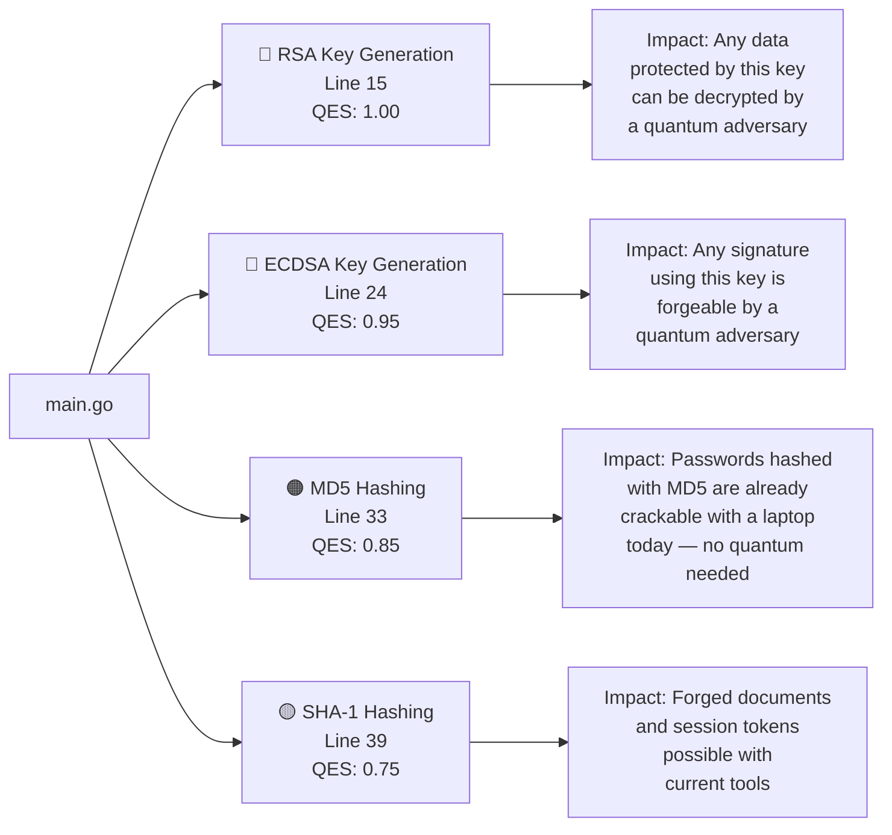
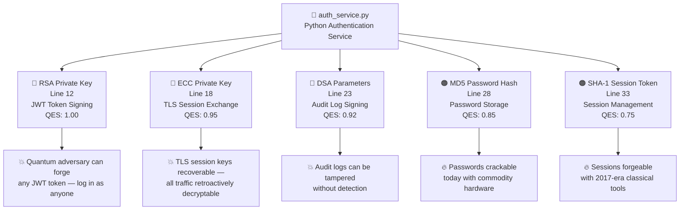
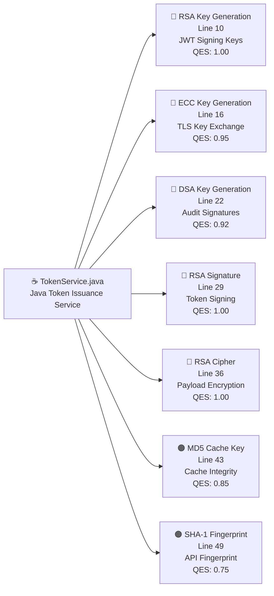
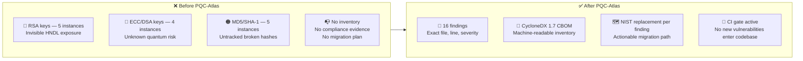
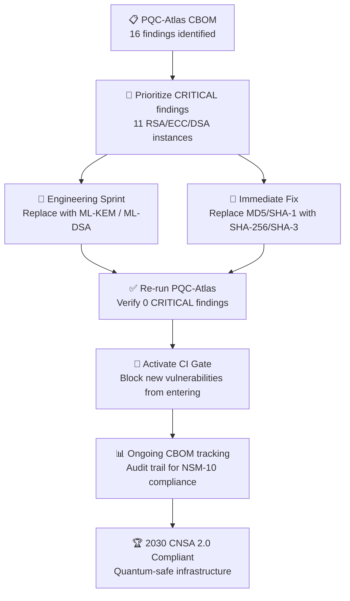

# Examples — What PQC-Atlas Finds and Why It Matters

> **No technical background needed.** This page walks through every example file line by line, explains each vulnerability in plain English, and shows you exactly what PQC-Atlas reports — and why it matters for your organization.

---

<div align="center">


</div>

---

## The Big Picture — One Diagram

Before diving into code, here is the core idea in one picture:



---

## The Three Example Files

The repository includes a realistic simulation of a company's authentication and token service — the kind of system that handles user logins, session security, and data encryption at almost every modern company.

| File | Language | What It Simulates | Findings |
|------|----------|-------------------|----------|
| `examples/legacy-app/main.go` | Go | Core backend service with cryptographic utilities | 4 vulnerabilities |
| `examples/legacy-app/auth_service.py` | Python | User authentication and password service | 5 vulnerabilities |
| `examples/legacy-app/TokenService.java` | Java | Token issuance and payload encryption | 7 vulnerabilities |
| **Total** | **3 languages** | **Realistic multi-service application** | **16 findings** |

---

---

# Example 1 — `main.go` (Go Backend Service)

## What This File Represents

Imagine your company's backend — the engine that handles user sessions, creates security keys, and processes sensitive data. This Go file simulates exactly that kind of service.

---

## The Analogy — Padlocks and Skeleton Keys

Think of encryption like a padlock on your front door.

- **RSA and ECC** are the most popular padlocks in the world. Billions of websites use them right now.
- **A quantum computer running Shor's Algorithm** is like a master key that opens every RSA and ECC padlock ever made — instantly, silently, with no damage to the lock.
- **MD5 and SHA-1** are like padlocks that were already picked with classical (non-quantum) tools years ago — anyone with a laptop can open them today.

PQC-Atlas walks through your code looking for every padlock you are using — and tells you which ones can be opened by adversaries right now, and which ones will be opened when quantum computers mature.

---

## The Vulnerabilities — Plain English



---

### Finding 1 — RSA Key Generation (CRITICAL 🔴)

```go
// Line 15 — main.go
privateKey, err := rsa.GenerateKey(rand.Reader, 2048)
```

**What this code does in plain English:**
This line creates a digital padlock — a cryptographic key — using the RSA algorithm with a 2048-bit size. This padlock is used to protect data: perhaps user tokens, API communications, or sensitive records.

**Why it is dangerous:**
RSA works because factoring very large numbers is mathematically hard — for a classical computer. For a quantum computer running Shor's Algorithm, factoring the same numbers takes only hours. The key size (2048-bit) does not help. Even a 4096-bit RSA key is completely defeated by Shor's Algorithm.

**Who is affected:**
Any data currently protected by this RSA key is at risk from Harvest Now, Decrypt Later attacks. Adversaries may already have copies of your encrypted data, waiting for quantum hardware to arrive.

**The fix:**
Replace `rsa.GenerateKey` with ML-KEM (CRYSTALS-Kyber), the NIST FIPS 203 post-quantum replacement for RSA key exchange.

| Property | Value |
|----------|-------|
| Severity | 🔴 CRITICAL |
| QES Score | 1.00 / 1.10 |
| NIST Replacement | FIPS 203 — ML-KEM (CRYSTALS-Kyber) |
| Migration Urgency | Before 2027 for new systems |

---

### Finding 2 — ECDSA Key Generation (CRITICAL 🔴)

```go
// Line 24 — main.go
privateKey, err := ecdsa.GenerateKey(elliptic.P256(), rand.Reader)
```

**What this code does in plain English:**
This creates a signing key using Elliptic Curve cryptography. Think of it like a digital pen that only you can hold — you use it to sign documents (tokens, API responses, certificates) to prove they came from you.

**Why it is dangerous:**
ECC is based on the elliptic curve discrete logarithm problem — a mathematical puzzle that classical computers cannot efficiently solve. Shor's Algorithm solves it trivially. A quantum adversary who captures your signed communications can forge your digital signature, impersonate your service, or tamper with signed records.

**The fix:**
Replace ECDSA with ML-DSA (CRYSTALS-Dilithium), the NIST FIPS 204 post-quantum replacement for digital signatures.

| Property | Value |
|----------|-------|
| Severity | 🔴 CRITICAL |
| QES Score | 0.95 / 1.10 |
| NIST Replacement | FIPS 204 — ML-DSA (CRYSTALS-Dilithium) |
| Migration Urgency | Before 2027 for new systems |

---

### Finding 3 — MD5 Hashing (HIGH 🟠)

```go
// Line 33 — main.go
h := md5.New()
h.Write([]byte(data))
```

**What this code does in plain English:**
MD5 takes any piece of data and produces a short "fingerprint" of it. It is often used to verify that a file has not been tampered with, or historically, to store passwords.

**Why it is dangerous:**
MD5 was broken in **2004** — with classical computers, no quantum hardware needed. Two completely different documents can be made to produce the same MD5 fingerprint (this is called a collision). A forged document that matches a legitimate document's MD5 fingerprint is indistinguishable by a system relying on MD5 for integrity checks. If this is used for passwords, those passwords can be reversed with freely available lookup tables.

**This is a fire that is already burning.** No quantum computer is needed to exploit MD5 today.

| Property | Value |
|----------|-------|
| Severity | 🟠 HIGH |
| QES Score | 0.85 / 1.10 |
| NIST Replacement | FIPS 202 — SHA-3-256 |
| Migration Urgency | Immediate |

---

### Finding 4 — SHA-1 Hashing (HIGH 🟠)

```go
// Line 39 — main.go
h := sha1.New()
h.Write([]byte(data))
```

**What this code does in plain English:**
SHA-1 is an older fingerprinting algorithm, similar to MD5 but slightly stronger. It was once used in SSL certificates, software signatures, and version control systems (including early Git).

**Why it is dangerous:**
SHA-1 was officially broken in **2017** by Google's SHAttered attack — a real-world collision was demonstrated for the first time, meaning two different files could produce identical SHA-1 fingerprints. Beyond that, Grover's Algorithm further halves its remaining quantum security margin. Any system relying on SHA-1 for trust decisions is already at risk.

| Property | Value |
|----------|-------|
| Severity | 🟠 HIGH |
| QES Score | 0.75 / 1.10 |
| NIST Replacement | SHA-256 or FIPS 202 — SHA-3 |
| Migration Urgency | Immediate |

---

### PQC-Atlas Output for `main.go`

```
[go]  examples/legacy-app/main.go:15   RSA-Legacy-2048   CRITICAL  QES:1.00  → FIPS 203 ML-KEM
[go]  examples/legacy-app/main.go:24   ECDSA-Legacy      CRITICAL  QES:0.95  → FIPS 204 ML-DSA
[go]  examples/legacy-app/main.go:33   MD5               HIGH      QES:0.85  → FIPS 202 SHA-3
[go]  examples/legacy-app/main.go:39   SHA-1             HIGH      QES:0.75  → SHA-256 / SHA-3
```

---

---

# Example 2 — `auth_service.py` (Python Authentication Service)

## What This File Represents

The authentication service is the gatekeeper of your entire system. It decides who is allowed in. Every login, every session token, every password check flows through this service. This Python file simulates that exact scenario — with five distinct cryptographic vulnerabilities embedded in it.

---

## The Analogy — The Gatekeeper with Stolen Keys

Imagine your building's security guard who checks ID badges at the door. The guard uses a master key to verify badges are authentic.

Now imagine an adversary has been quietly photographing that master key every time it is used. They are not breaking in today. They are building a copy. One day — when they have the right equipment — they will walk right in.

That is what HNDL does to authentication services using RSA, ECC, and DSA. And MD5-hashed passwords? Those are already being cracked — the adversary does not even need to wait.

---

## The Vulnerabilities — Visual Summary



---

### Finding 1 — RSA Key for JWT Token Signing (CRITICAL 🔴)

```python
# Line 12 — auth_service.py
private_key = rsa.generate_private_key(
    public_exponent=65537,
    key_size=2048,
    backend=default_backend()
)
```

**What this code does in plain English:**
This creates the signing key used to generate JWT tokens — the digital badges that prove a user is logged in. When you log into a web application and your session is maintained across browser refreshes, there is almost always a JWT token involved, signed with a key exactly like this one.

**The impact of compromise:**
If a quantum adversary recovers this private key using Shor's Algorithm, they can generate valid JWT tokens for any user in the system — including administrators. They can impersonate any account, access any data, and do so silently with no authentication logs.

**Real-world parallel:**
This is equivalent to an adversary being able to print valid government ID cards for any identity they choose.

---

### Finding 2 — ECC Key for TLS Session Exchange (CRITICAL 🔴)

```python
# Line 18 — auth_service.py
ec_key = ec.generate_private_key(
    curve=ec.SECP256R1(),
    backend=default_backend()
)
```

**What this code does in plain English:**
This creates the key used in TLS handshakes — the process that establishes the secure "tunnel" between a user's browser and your server. Every HTTPS connection begins with this key exchange.

**The impact of compromise:**
Adversaries running HNDL attacks are storing recordings of TLS handshakes today. Once a quantum computer exists, they can recover this key and decrypt every past TLS session they recorded — including login credentials, financial transactions, and private messages.

**Real-world parallel:**
A phone call you made five years ago is sitting in a recording. Today it sounds like noise. Tomorrow, someone decrypts it and hears every word.

---

### Finding 3 — DSA Key for Audit Log Signing (CRITICAL 🔴)

```python
# Line 23 — auth_service.py
dsa_params = dsa.generate_parameters(
    key_size=1024,
    backend=default_backend()
)
```

**What this code does in plain English:**
DSA (Digital Signature Algorithm) is used here to sign audit logs — the tamper-evident record of everything that happens in the system (who logged in, what they accessed, what changed). A valid signature on an audit log proves it has not been altered.

**The impact of compromise:**
If this signing key is recovered by a quantum adversary, they can retroactively forge audit entries — or delete real ones — and re-sign the modified log so it appears legitimate. In a regulated environment (finance, healthcare, government), this defeats the entire compliance and forensics capability.

**Additional note:** This key is only 1024 bits — which is already considered too short even by classical standards and is deprecated under current FIPS 186-5 guidance.

---

### Finding 4 — MD5 Password Hashing (HIGH 🟠)

```python
# Line 28 — auth_service.py
def hash_password(password: str) -> str:
    return hashlib.md5(password.encode()).hexdigest()
```

**What this code does in plain English:**
When a user creates an account and sets a password, this function converts that password into a scrambled fingerprint before storing it. The idea is that even if the database is stolen, the attacker cannot read the original passwords.

**Why this is already broken:**
MD5 is so thoroughly defeated that free online tools called "rainbow tables" contain pre-computed MD5 hashes for billions of common passwords. If your database is leaked, an attacker can look up most MD5 hashes and recover the original passwords in seconds — on a phone, with no special hardware.

No quantum computer is needed. This is a fire burning right now.

---

### Finding 5 — SHA-1 Session Token (HIGH 🟠)

```python
# Line 33 — auth_service.py
def generate_token(seed: str) -> str:
    return hashlib.sha1(seed.encode()).hexdigest()
```

**What this code does in plain English:**
This creates session tokens — the temporary ID cards that your server gives your browser after you log in. Every time your browser sends a request, it includes this token to prove you are still authenticated.

**The impact:**
SHA-1 was broken in 2017. An adversary who can produce SHA-1 collisions can forge a token that the server believes is legitimate — without ever knowing the user's password. This is a session hijacking vulnerability exploitable with classical tools today.

---

### PQC-Atlas Output for `auth_service.py`

```
[python]  auth_service.py:12   RSA-Legacy-2048   CRITICAL  QES:1.00  → FIPS 203 ML-KEM
[python]  auth_service.py:18   ECC-Legacy        CRITICAL  QES:0.95  → FIPS 204 ML-DSA
[python]  auth_service.py:23   DSA-Legacy-1024   CRITICAL  QES:0.92  → FIPS 204 ML-DSA
[python]  auth_service.py:28   MD5               HIGH      QES:0.85  → FIPS 202 SHA-3
[python]  auth_service.py:33   SHA-1             HIGH      QES:0.75  → SHA-256 / SHA-3
```

---

---

# Example 3 — `TokenService.java` (Java Token Service)

## What This File Represents

This Java class represents the most vulnerable file in the example application — seven findings across five different vulnerability classes. It simulates a token issuance service: a central component that generates, signs, and encrypts the credentials that users and services use to authenticate with each other.

This type of service is found in every enterprise system. Compromise it and you compromise everything that trusts its tokens.

---

## The Analogy — The Master Vault

Think of the token service as a bank's master vault. Every other vault in the bank trusts tokens issued by this one. Compromise the master vault's lock mechanism — even retroactively — and every vault it has ever issued credentials for is compromised.

Every RSA, ECC, and DSA key used in this service is a lock that a quantum computer can open. Every MD5 and SHA-1 operation is a lock that classical tools can already pick.

---

## Seven Findings — At a Glance



---

### Finding 1 — RSA Key Generation for JWT Signing (CRITICAL 🔴)

```java
// Line 10 — TokenService.java
KeyPairGenerator kpg = KeyPairGenerator.getInstance("RSA");
kpg.initialize(2048);
kpg.generateKeyPair();
```

**Plain English:**
This generates the RSA key pair that the token service uses to sign JWT tokens. Every authenticated request to every service that trusts these tokens depends on this key's integrity.

**The stakes:** Compromise of this key through a quantum attack means an adversary can sign valid tokens for any identity — any user, any service account, any administrator — at will.

---

### Finding 2 — ECC Key Generation for TLS (CRITICAL 🔴)

```java
// Line 16 — TokenService.java
KeyPairGenerator kpg = KeyPairGenerator.getInstance("EC");
kpg.initialize(256);
kpg.generateKeyPair();
```

**Plain English:**
This creates the elliptic curve key used when the token service establishes secure connections with other services over the network (TLS). It protects the confidentiality of tokens and credentials in transit.

**The stakes:** HNDL attacks store TLS handshakes. When a quantum computer becomes available, every past conversation between your services is retroactively decryptable — credentials, tokens, sensitive payloads, all of it.

---

### Finding 3 — DSA Key Generation for Audit Signatures (CRITICAL 🔴)

```java
// Line 22 — TokenService.java
KeyPairGenerator kpg = KeyPairGenerator.getInstance("DSA");
kpg.initialize(1024);
kpg.generateKeyPair();
```

**Plain English:**
This creates the DSA key used to sign audit log entries — the tamper-proof record that everything happening in the system has been faithfully recorded.

**Double vulnerability:** 1024-bit DSA is already deprecated under classical standards (FIPS 186-5). This key is vulnerable to both classical and quantum attacks.

---

### Finding 4 — RSA Signature for Token Signing (CRITICAL 🔴)

```java
// Line 29 — TokenService.java
Signature sig = Signature.getInstance("SHA256withRSA");
sig.initSign(key);
sig.update(data);
sig.sign();
```

**Plain English:**
This signs tokens using RSA — the digital equivalent of stamping a document with a corporate seal. Other services verify the seal before trusting the token.

**The impact:** A quantum adversary who can recover or forge the RSA signing key can produce valid-looking tokens without ever having authenticated with your system. They become invisible inside your trusted service mesh.

---

### Finding 5 — RSA Cipher for Payload Encryption (CRITICAL 🔴)

```java
// Line 36 — TokenService.java
Cipher cipher = Cipher.getInstance("RSA/ECB/PKCS1Padding");
cipher.init(Cipher.ENCRYPT_MODE, key);
cipher.doFinal(data);
```

**Plain English:**
This encrypts the actual content of tokens using RSA — protecting sensitive claim data (user ID, roles, permissions) so that only the intended recipient can read it.

**Additional weakness:** The `RSA/ECB/PKCS1Padding` mode is considered insecure even by classical standards due to padding oracle vulnerabilities (PKCS#1 v1.5). This is vulnerable to two distinct attack classes: classical padding oracle and quantum Shor's attack.

**Correct post-quantum replacement:**
- For token encryption: ML-KEM (FIPS 203) for the key encapsulation layer
- Remove PKCS#1 v1.5 padding and replace with OAEP as an interim step

---

### Finding 6 — MD5 Cache Key Generation (HIGH 🟠)

```java
// Line 43 — TokenService.java
MessageDigest md = MessageDigest.getInstance("MD5");
byte[] hash = md.digest(input.getBytes());
```

**Plain English:**
The token service uses MD5 to generate cache keys — unique identifiers for cached token data. If a cache key can be spoofed, an attacker could poison the cache with forged entries.

**The impact:**
MD5 collisions mean two different inputs can produce the same cache key. An attacker with collision capability could craft a request whose MD5 hash matches an existing cached token — accessing data intended for a different user.

---

### Finding 7 — SHA-1 API Fingerprint (HIGH 🟠)

```java
// Line 49 — TokenService.java
MessageDigest md = MessageDigest.getInstance("SHA-1");
byte[] hash = md.digest(input.getBytes());
```

**Plain English:**
This generates fingerprints for API request validation — a way of verifying that a request has not been tampered with in transit. This is a common pattern in older API authentication schemes (HMAC-style request signing).

**The impact:**
SHA-1 collision attacks allow an attacker to craft a different request payload that produces the same fingerprint — effectively forging API requests as if they came from a legitimate caller.

---

### PQC-Atlas Output for `TokenService.java`

```
[java]  TokenService.java:10   RSA-Legacy-2048    CRITICAL  QES:1.00  → FIPS 203 ML-KEM
[java]  TokenService.java:16   ECC-Legacy-P256    CRITICAL  QES:0.95  → FIPS 204 ML-DSA
[java]  TokenService.java:22   DSA-Legacy-1024    CRITICAL  QES:0.92  → FIPS 204 ML-DSA
[java]  TokenService.java:29   RSA-Signature      CRITICAL  QES:1.00  → FIPS 204 ML-DSA
[java]  TokenService.java:36   RSA-Cipher         CRITICAL  QES:1.00  → FIPS 203 ML-KEM
[java]  TokenService.java:43   MD5                HIGH      QES:0.85  → FIPS 202 SHA-3
[java]  TokenService.java:49   SHA-1              HIGH      QES:0.75  → SHA-256 / SHA-3
```

---

---

# Complete Scan — All Three Files Together

This is what PQC-Atlas produces when scanning the entire `examples/legacy-app/` directory:

```
$ go run main.go scan --path examples/legacy-app/ --output cbom.json

[go]     main.go:15              RSA-Legacy-2048    CRITICAL  QES:1.00  → FIPS 203 ML-KEM
[go]     main.go:24              ECDSA-Legacy       CRITICAL  QES:0.95  → FIPS 204 ML-DSA
[go]     main.go:33              MD5                HIGH      QES:0.85  → FIPS 202 SHA-3
[go]     main.go:39              SHA-1              HIGH      QES:0.75  → SHA-256
[python] auth_service.py:12      RSA-Legacy-2048    CRITICAL  QES:1.00  → FIPS 203 ML-KEM
[python] auth_service.py:18      ECC-Legacy         CRITICAL  QES:0.95  → FIPS 204 ML-DSA
[python] auth_service.py:23      DSA-Legacy-1024    CRITICAL  QES:0.92  → FIPS 204 ML-DSA
[python] auth_service.py:28      MD5                HIGH      QES:0.85  → FIPS 202 SHA-3
[python] auth_service.py:33      SHA-1              HIGH      QES:0.75  → SHA-256
[java]   TokenService.java:10    RSA-Legacy-2048    CRITICAL  QES:1.00  → FIPS 203 ML-KEM
[java]   TokenService.java:16    ECC-Legacy-P256    CRITICAL  QES:0.95  → FIPS 204 ML-DSA
[java]   TokenService.java:22    DSA-Legacy-1024    CRITICAL  QES:0.92  → FIPS 204 ML-DSA
[java]   TokenService.java:29    RSA-Signature      CRITICAL  QES:1.00  → FIPS 204 ML-DSA
[java]   TokenService.java:36    RSA-Cipher         CRITICAL  QES:1.00  → FIPS 203 ML-KEM
[java]   TokenService.java:43    MD5                HIGH      QES:0.85  → FIPS 202 SHA-3
[java]   TokenService.java:49    SHA-1              HIGH      QES:0.75  → SHA-256

[+] Scan Complete — 16 findings in 3.51ms
    CRITICAL : 11  (quantum-vulnerable — HNDL risk)
    HIGH     :  5  (classically broken or quantum-weakened)
    MEDIUM   :  0
[+] CBOM written to cbom.json (CycloneDX 1.7, 16 components)
```

---

## The Before and After



---

## Summary by Algorithm

| Algorithm | Instances | Severity | Already Broken? | Quantum Broken? | Replace With |
|-----------|-----------|----------|-----------------|-----------------|-------------|
| RSA-2048 | 5 | 🔴 CRITICAL | No | Yes (Shor) | ML-KEM / ML-DSA |
| ECC (P-256) | 3 | 🔴 CRITICAL | No | Yes (Shor) | ML-DSA |
| DSA-1024 | 2 | 🔴 CRITICAL | Yes (size) | Yes (Shor) | ML-DSA |
| MD5 | 3 | 🟠 HIGH | **Yes (2004)** | Yes (Grover) | SHA-3-256 |
| SHA-1 | 3 | 🟠 HIGH | **Yes (2017)** | Yes (Grover) | SHA-256 |

---

## What Happens Next — The Migration Path



---

*To run the scan yourself: `go run main.go scan --path examples/legacy-app/`*
*See [Quick Start](Quick-Start) for step-by-step setup instructions.*
