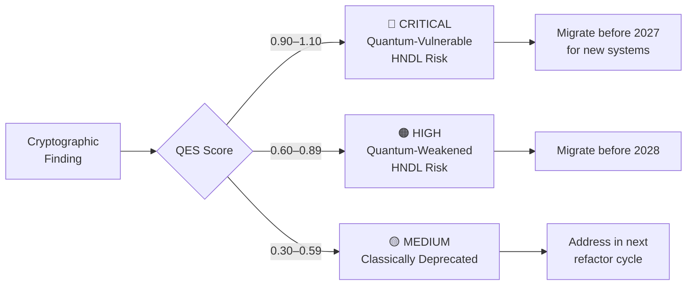

# Risk Taxonomy

> PQC-Atlas classifies every cryptographic finding into one of three tiers. This page explains the classification system, the Quantum Exposure Score (QES), and the decision matrix for each tier.

---

## The Three Tiers



---

## CRITICAL — Quantum-Vulnerable (HNDL Risk)

**QES Range: 0.90 – 1.10**

These algorithms are mathematically broken by a Cryptographically Relevant Quantum Computer (CRQC) using **Shor's Algorithm**. A CRQC running Shor's Algorithm can factor RSA keys and solve elliptic curve discrete logarithm problems in **hours**.

Data encrypted with these algorithms is already being harvested by adversaries for retroactive decryption. Migration is not optional.

### Affected Algorithms

| Algorithm | OID | Why Broken | NIST Replacement | QES |
|-----------|-----|------------|-----------------|-----|
| RSA (all key sizes) | 1.2.840.113549.1.1.1 | Integer factorization — Shor's Algorithm | **FIPS 203 — ML-KEM** | 1.00 |
| ECC / ECDSA | 1.2.840.10045.4.3.2 | Elliptic curve discrete log — Shor's Algorithm | **FIPS 204 — ML-DSA** | 0.95 |
| DSA | 1.2.840.10040.4.1 | Discrete logarithm — Shor's Algorithm | **FIPS 204 — ML-DSA** | 0.92 |
| DH / ECDH | 1.2.840.113549.1.3.1 | Key exchange on discrete log basis | **FIPS 203 — ML-KEM** | 0.90 |

### Business Meaning

Every byte of data currently protected by RSA, ECC, or DSA can be decrypted retroactively once a CRQC exists. HNDL attacks mean sensitive data encrypted **today** may already be stored by adversaries awaiting that moment.

### Required Action

| Audience | Action |
|----------|--------|
| CISO | Declare P0 incident. Begin migration planning. |
| Engineering Lead | Open P0 tickets for every CRITICAL finding. Block deployment of new code using these algorithms. |
| Compliance Officer | Report to NSM-10 inventory. Flag for CNSA 2.0 milestone tracking. |
| Timeline | All new systems: before 2027. All systems: before 2030. |

---

## HIGH — Quantum-Weakened (HNDL Risk)

**QES Range: 0.60 – 0.89**

These algorithms are not broken by Shor's Algorithm but are significantly weakened by **Grover's Algorithm**, which effectively halves the security bit length of any symmetric or hash primitive. Some are also already broken classically.

They carry HNDL risk for long-lived sensitive data and must be addressed before the 2028 milestone.

### Affected Algorithms

| Algorithm | Why Weakened | Effective Quantum Security | NIST Replacement | QES |
|-----------|-------------|---------------------------|-----------------|-----|
| MD5 | Classically broken (collisions since 2004) + Grover | ~0 bits | **SHA-3 (FIPS 202)** | 0.85 |
| SHA-1 | Collision-broken since 2017 + Grover | ~40 bits | **SHA-256 or SHA-3** | 0.75 |
| DES / 3DES | Key too short classically; Grover eliminates margin | ~28 bits | **AES-256** | 0.72 |
| AES-128 | Grover reduces to 64-bit effective quantum security | 64 bits | **AES-256** | 0.65 |

### Business Meaning

These algorithms have degraded or eliminated security margins. MD5 and SHA-1 are already classically broken — any system still relying on them for integrity or authentication is vulnerable to classical attacks today, not just quantum attacks tomorrow.

---

## MEDIUM — Classically Deprecated

**QES Range: 0.30 – 0.59**

These algorithms are not quantum-vulnerable but are deprecated by current classical standards. They represent technical debt and compliance risk under FIPS 140-3, SOC 2, and PCI DSS audits.

### Affected Algorithms

| Algorithm | Status | Recommendation | QES |
|-----------|--------|---------------|-----|
| RC4 | Classically broken stream cipher | Remove immediately | 0.55 |
| MD4 | Predecessor to MD5, classically broken | Remove immediately | 0.52 |
| SHA-256 (legacy contexts) | Classically sound; minor Grover weakening | Acceptable; monitor NIST guidance | 0.35 |

---

## Quantum Exposure Score (QES) — Full Methodology

QES is a composite metric calculated from four weighted factors:

```
QES = (Algorithm Class × 0.50)
    + (Key Size Factor × 0.25)
    + (HNDL Exposure × 0.15)
    + (NIST Urgency × 0.10)
```

| Factor | Description |
|--------|-------------|
| **Algorithm Class** | Public-key algorithms (RSA, ECC) score highest. Hash functions score lower. Symmetric algorithms score lowest. |
| **Key Size** | Larger key sizes do not reduce quantum risk for public-key algorithms — they only delay classical attacks. |
| **HNDL Exposure** | Algorithms used for long-lived secrets (identity, TLS, signing) score higher than ephemeral use cases. |
| **NIST Urgency** | Algorithms explicitly named in CNSA 2.0 Phase 1 requirements score highest. |

---

## Decision Matrix

| Finding Tier | Immediate Action | Owner | Deadline |
|---|---|---|---|
| 🔴 CRITICAL | Block deployment. Open P0 ticket. Begin ML-KEM/ML-DSA migration. | CISO + Engineering Lead | New systems: 2027 · All systems: 2030 |
| 🟠 HIGH | Schedule migration sprint. Document in cryptographic roadmap. | Security Engineering | Before 2028 |
| 🟡 MEDIUM | Address in next refactor. Document exception if deferred >12 months. | Engineering | Within 12 months |

---

## NIST Replacement Map

| Legacy Algorithm | Quantum Risk | NIST Standard | New Algorithm | Purpose |
|-----------------|-------------|--------------|--------------|---------|
| RSA (encrypt) | CRITICAL | FIPS 203 | ML-KEM (CRYSTALS-Kyber) | Key encapsulation |
| RSA (sign) | CRITICAL | FIPS 204 | ML-DSA (CRYSTALS-Dilithium) | Digital signatures |
| ECDSA | CRITICAL | FIPS 204 | ML-DSA (CRYSTALS-Dilithium) | Digital signatures |
| ECDH | CRITICAL | FIPS 203 | ML-KEM (CRYSTALS-Kyber) | Key exchange |
| DSA | CRITICAL | FIPS 204 | ML-DSA (CRYSTALS-Dilithium) | Digital signatures |
| MD5 | HIGH | FIPS 202 | SHA-3-256 | Hashing |
| SHA-1 | HIGH | FIPS 180-4 | SHA-256 or SHA-3 | Hashing |
| DES / 3DES | HIGH | FIPS 197 | AES-256 | Symmetric encryption |
