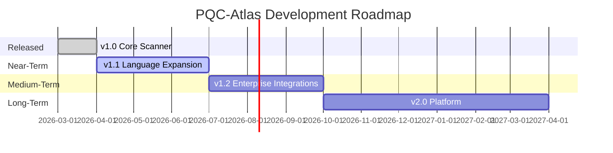
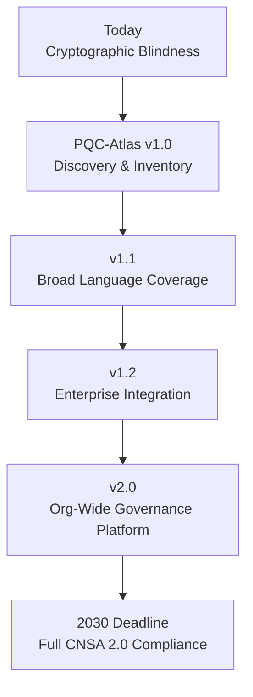

# Roadmap

> Current capabilities, planned milestones, and the strategic vision for PQC-Atlas.

---

## Version Timeline

---

## v1.0 — Available Now ✅

PQC-Atlas v1.0 is fully operational. Every capability below is live.

| Capability | Status | Detail |
|------------|--------|--------|
| Go AST scanner | ✅ Live | Structural detection via Abstract Syntax Tree parsing |
| Python regex scanner | ✅ Live | Pattern-based detection of PyCryptodome, cryptography library |
| Java regex scanner | ✅ Live | JCA/JCE pattern detection |
| Quantum Exposure Scoring (QES) | ✅ Live | 0.00–1.10 composite risk metric |
| CycloneDX 1.7 CBOM output | ✅ Live | Machine-readable, GRC-ingestible |
| NIST FIPS 203/204/205 mapping | ✅ Live | Per-finding replacement guidance |
| GitHub Actions CI gate | ✅ Live | Blocks PRs on CRITICAL/HIGH findings |
| 90-day CBOM artifact retention | ✅ Live | Signed audit trail per merge |
| Zero external dependencies | ✅ Live | Go standard library only |
| NSM-10 / CNSA 2.0 alignment | ✅ Live | Findings mapped to federal mandate tiers |

**Validated:** 17 findings · 3 languages · 3.51ms scan time

---

## v1.1 — Next 90 Days 🔨

> **Focus:** Broader language coverage and richer output formats

| Feature | Description | Target Audience |
|---------|-------------|----------------|
| **Rust scanner** | AST-based detection of `ring`, `rustls`, and `openssl` crate usage | Systems and embedded teams |
| **C / C++ scanner** | Regex detection of OpenSSL, libgcrypt, and Botan API calls | Infrastructure and firmware teams |
| **JavaScript / TypeScript scanner** | Detection of Node.js `crypto` module and `node-forge` usage | Full-stack and Node.js teams |
| **SARIF output** | Security results in SARIF format for GitHub Advanced Security and VS Code | DevSecOps engineers |
| **Severity filter flag** | `--min-severity=HIGH` CLI flag | All engineers |
| **HTML report** | Human-readable scan report alongside machine-readable CBOM | Security managers and auditors |
| **Dependency manifest scanning** | Detect quantum-vulnerable packages in `go.sum`, `requirements.txt`, `pom.xml` | Supply chain security teams |

---

## v1.2 — 6 Months 🗓️

> **Focus:** Enterprise integrations and compliance automation

| Feature | Description | Target Audience |
|---------|-------------|----------------|
| **GitLab CI integration** | Native `.gitlab-ci.yml` gate template | Teams on GitLab |
| **Jira auto-ticketing** | Opens a tracked P0 ticket per CRITICAL finding | Security operations teams |
| **Trend tracking** | CBOM snapshot comparison across commits — shows cryptographic drift | CISOs and compliance officers |
| **Custom rule engine** | Organization-specific detection rules in YAML | Enterprise security teams |
| **NIST SP 800-235 alignment** | Map findings to NIST's PQC migration project guidance | Federal compliance teams |
| **Azure DevOps integration** | Native pipeline task | Microsoft-stack teams |

---

## v2.0 — 12 Months 🔭

> **Focus:** Enterprise-grade cryptographic governance platform

| Feature | Description | Target Audience |
|---------|-------------|----------------|
| **Web dashboard** | Real-time cryptographic inventory across all repositories in an organization | CISOs and security directors |
| **GRC platform connectors** | Direct CBOM export to ServiceNow GRC, Archer, and OneTrust | Compliance and risk teams |
| **Migration playbooks** | Automated, language-specific code transformation suggestions | Engineering teams |
| **Certificate and key store scanning** | Inventory X.509 certificates and key material by algorithm | Infrastructure and PKI teams |
| **Multi-repo organizational scan** | Scan an entire GitHub organization in a single command | Enterprise security teams |
| **Federal OSCAL output** | Findings in NIST OSCAL format for FedRAMP and FISMA submissions | Federal agencies and contractors |
| **IDE plugin** | VS Code and IntelliJ extension for real-time cryptographic linting | Individual developers |

---

## Strategic Vision

The 2030 CNSA 2.0 compliance deadline creates a hard constraint for every organization in or adjacent to the US federal market. The bottleneck is not expertise — it is **discovery**. Security teams cannot migrate what they cannot find.

PQC-Atlas's long-term goal is to be the **cryptographic observability layer** for every engineering organization undergoing post-quantum migration — the same way dependency scanners (Snyk, Dependabot) became standard practice for supply chain security.

---

## Influence the Roadmap

- Open a [GitHub Issue](https://github.com/saisravan909/pqc-atlas/issues) labeled `roadmap`
- Start a [GitHub Discussion](https://github.com/saisravan909/pqc-atlas/discussions) for broader feature conversations
- Submit a pull request — accepted contributions accelerate roadmap items
